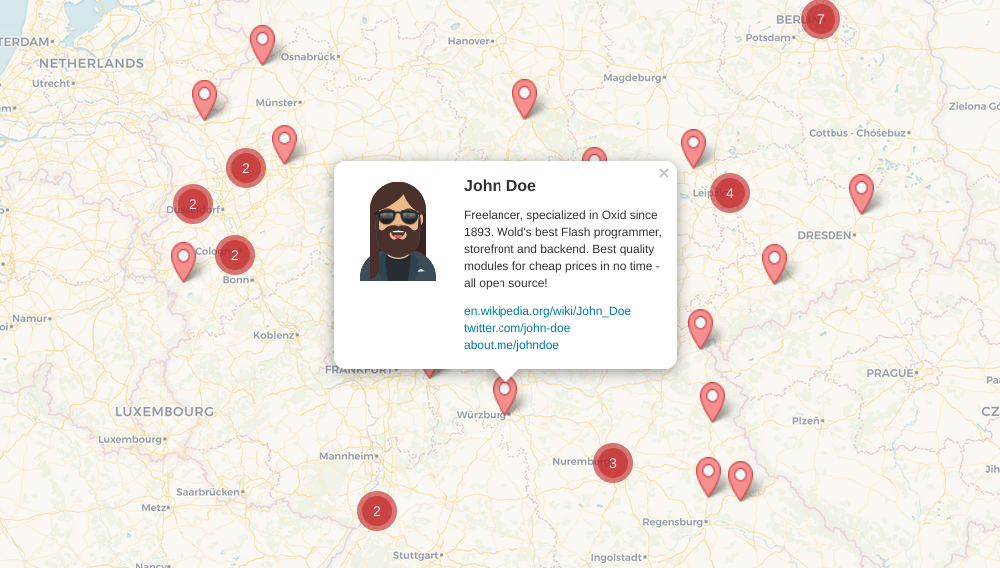

# Oxid Community Map

A map filled with people being involved in Oxid development. Hosted on GitHub, which allows everyone to add their map entries. ♥ Join us!

👉 __https://friendsofoxid.github.io/community-map/__

The screenshot above shows what user entries look like. You’ll even get your own URL for your entry, which is awesome! Look, this is a [link to Rüdiger](https://friendsofoxid.github.io/community-map/#gn2).

## How to add and manage your entry?

You can add your marker to the map and manage your data by yourself. Learn about [three ways how to manage your entry](https://github.com/FriendsOfOxid/community-map/tree/master/_directory)! 🚀

## Who’s the map for?

The map is for any person being involved in Oxid: developers, users, editors, writers, designers, translators, friends and family et al. It’s about visualizing the Oxid community. If you use or support Oxid, the map is for you!

## How does this map work?

No big deal: GitHub allows to generate static websites out of repositories. They make use of [Jekyll](https://jekyllrb.com), a ruby based generator. Jekyll comes with [Liquid](https://shopify.github.io/liquid/) templates, which helped us to inject all our map entries within a JSON at the bottom of the HTML. JavaScript grabs the data and starts a nice [Leaflet](http://leafletjs.com) map with beautiful tiles provided by [CARTO](https://carto.com/location-data-services/basemaps/).  
—Well, that’s it. ¯\\\_(ツ)_/¯

## Can we use your map for our community?

Sure, it’s open source! However, we don’t provide a release or some setup script. We’d recommend you to download the repo as zip file instead and make it run on your local machine first (see [SETUP.md](https://github.com/FriendsOfOxid/community-map/blob/master/SETUP.md) for instructions). Afterwards you’ll need to replace some `Oxid` or `REDAXO` content with your community content, empty the `_directory/data` folder and start over with a shiny fresh map.

In case you struggle, we’d love to help! 🙋‍♂️  
Also if your map is live we’d be grateful to receive a quick note from you: _friendsof [at] redaxo.org_. Thanks!

## How to run the map on my local machine?

See [SETUP.md](https://github.com/FriendsOfOxid/community-map/blob/master/SETUP.md) for instructions.

## What else?

Many thanks to the REDAXO community for supporting us with this great piece of software! 

You should join their Slack chat. It’s full of nice REDAXO people! ✌️  
Provide your email to receive an invitation: https://redaxo.org/slack/
